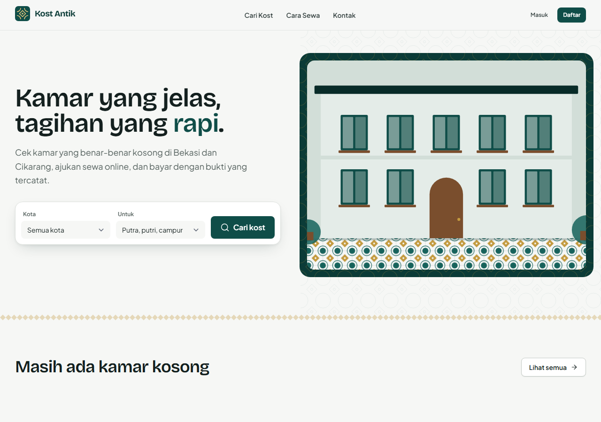
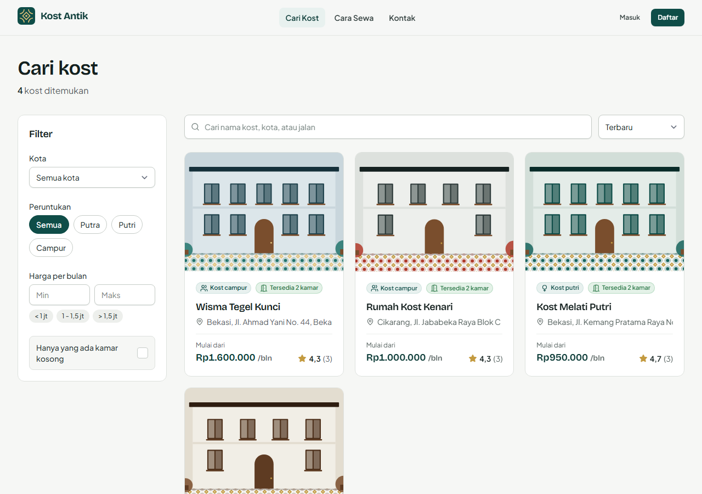
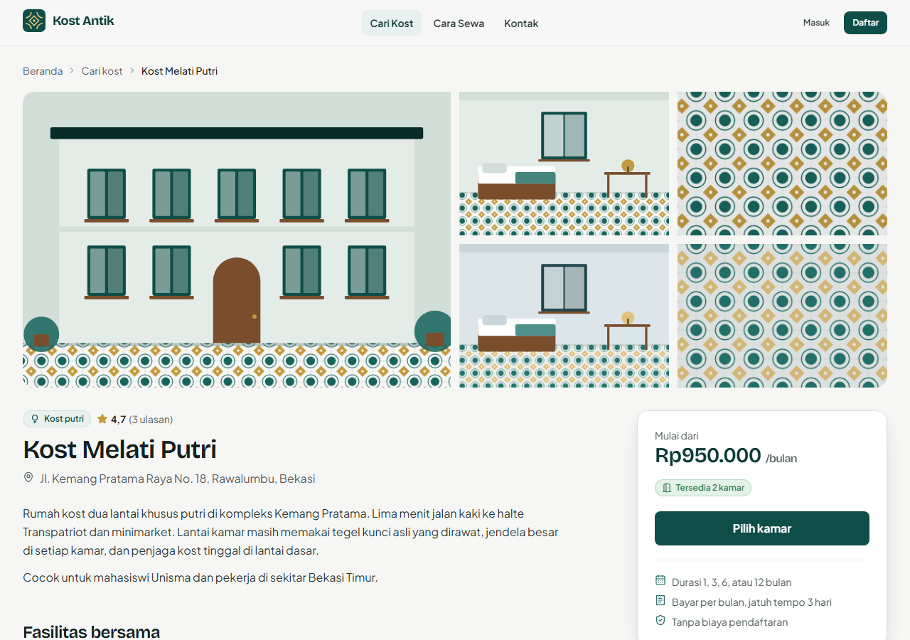
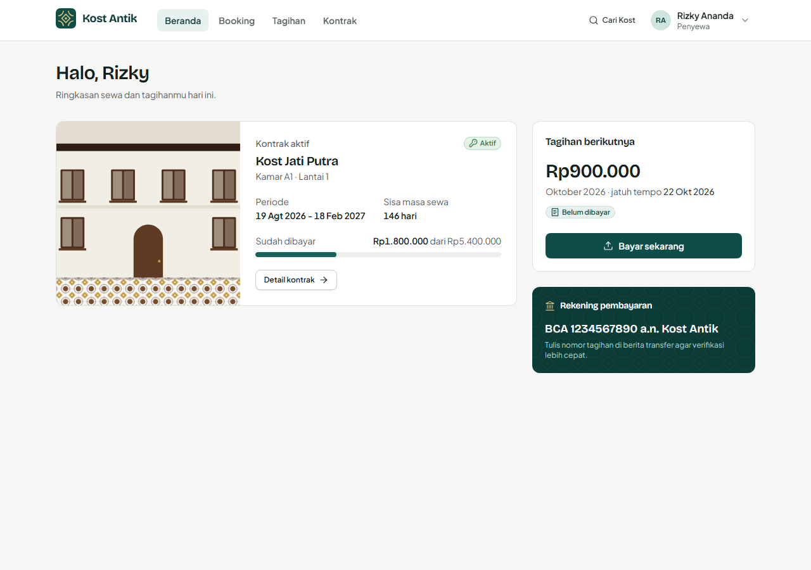
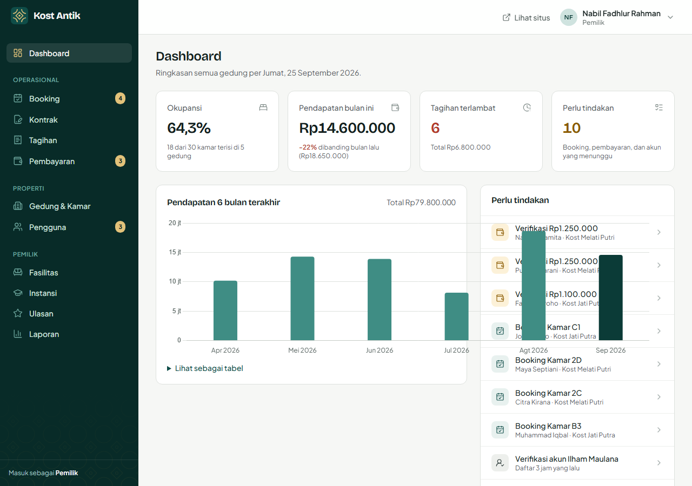
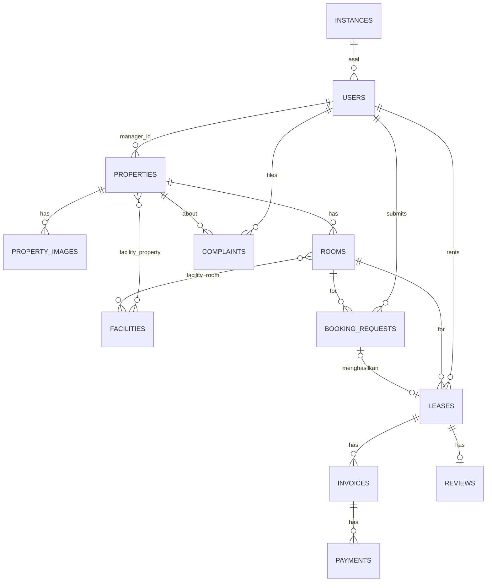

# Kost Antik

Sistem pemasaran & manajemen kost — katalog kamar publik, alur booking online, kontrak otomatis, tagihan bulanan, dan verifikasi pembayaran, untuk pemilik, pengelola, dan penyewa kost di Bekasi–Cikarang.



## Daftar isi

- [Fitur per role](#fitur-per-role)
- [Tech stack](#tech-stack)
- [Cara instalasi](#cara-instalasi)
- [Akun demo](#akun-demo)
- [Menjalankan scheduler & test](#menjalankan-scheduler--test)
- [Struktur folder](#struktur-folder)
- [ERD](#erd)
- [Dokumen lain](#dokumen-lain)

## Screenshot

| Katalog | Detail kost |
|---|---|
|  |  |

| Dashboard penyewa | Dashboard admin |
|---|---|
|  |  |

## Fitur per role

### Pengunjung (publik)
- Landing page dengan pencarian kota + peruntukan, kost unggulan, alasan memilih, cara sewa, ulasan penghuni.
- Katalog kost: cari nama/kota, filter peruntukan/harga/ketersediaan, urutkan (terbaru, termurah, rating), pagination.
- Detail kost: galeri + lightbox, fasilitas, daftar kamar per status, aturan kost, peta lokasi (Leaflet + OpenStreetMap), ulasan & rating.
- Tombol "Ajukan Sewa" mengarahkan ke login/daftar bila belum masuk, lalu kembali ke kamar yang dipilih.

### Penyewa (`/app`)
- Registrasi mandiri (status awal `pending`, menunggu verifikasi pemilik).
- Dashboard: kontrak aktif, progres pembayaran, tagihan berikutnya, pengajuan sewa terakhir.
- Ajukan booking kamar (tanggal, durasi 1/3/6/12 bulan, catatan) & batalkan selama `pending`.
- Daftar tagihan per tab (belum dibayar, menunggu verifikasi, lunas) + unggah bukti transfer.
- Riwayat & detail kontrak (timeline), tulis/ubah ulasan (setelah tinggal ≥ 30 hari atau kontrak selesai).
- Profil: ubah data diri, foto, ganti kata sandi.

### Pengelola (`/admin`, dibatasi ke gedung yang ditugaskan)
- Dashboard: okupansi, pendapatan bulan ini, tagihan terlambat, grafik pendapatan 6 bulan, panel "perlu tindakan".
- Kelola kamar gedungnya (CRUD, status, fasilitas) + ubah info dasar gedung.
- Proses booking (setujui → kontrak & tagihan otomatis, atau tolak dengan alasan).
- Verifikasi/tolak bukti bayar, catat pembayaran tunai.
- Kontrak: buat kontrak walk-in, akhiri kontrak lebih awal (dengan alasan).

### Pemilik (owner)
- Semua akses pengelola untuk seluruh gedung.
- CRUD gedung + galeri foto + fasilitas + penugasan pengelola.
- Master fasilitas & instansi asal penyewa.
- Kelola pengguna: setujui/tolak penyewa, buat akun pengelola, nonaktifkan/aktifkan akun.
- Moderasi ulasan (tampilkan/sembunyikan).
- Laporan pembayaran per periode + ekspor CSV.

### Otomatis (scheduler harian, 00:05–00:15 WIB)
- Tandai tagihan lewat jatuh tempo sebagai terlambat.
- Selesaikan kontrak yang melewati tanggal akhir, kembalikan status kamar.
- Kedaluwarsakan pengajuan sewa yang menunggu lebih dari 7 hari.

## Tech stack

Laravel 11 · PHP 8.2+ · Blade + Tailwind CSS 3 + Alpine.js · Vite · Laravel Breeze · spatie/laravel-permission · spatie/laravel-activitylog · Chart.js · Leaflet + OpenStreetMap · Lucide icons · MySQL 8 (SQLite untuk dev & test) · PHPUnit.

## Cara instalasi

Butuh PHP 8.2+, Composer, Node 18+, dan MySQL (opsional untuk dev — SQLite cukup).

```bash
git clone https://github.com/Fadhh12/Kost-Antik.git
cd Kost-Antik

composer install
npm install

cp .env.example .env
php artisan key:generate

# .env default memakai MySQL. Untuk dev cepat tanpa MySQL,
# ganti DB_CONNECTION=sqlite dan buat berkas kosong:
# touch database/database.sqlite

php artisan migrate --seed
php artisan storage:link

npm run build      # atau: npm run dev
php artisan serve
```

Buka `http://127.0.0.1:8000`.

## Akun demo

Kata sandi semua akun demo: **`password`**

| Role | Email |
|---|---|
| Pemilik | `owner@kostantik.test` |
| Pengelola | `manager@kostantik.test` |
| Pengelola | `manager2@kostantik.test` |
| Penyewa | `tenant@kostantik.test` |
| Penyewa | `tenant2@kostantik.test` |

Seeder juga membuat 25 penyewa tambahan dengan status campuran (`pending`, `rejected`, `inactive`), 5 gedung, 30 kamar, riwayat kontrak & pembayaran 6 bulan ke belakang, serta booking yang menunggu — cukup untuk mendemokan semua alur tanpa input manual.

## Menjalankan scheduler & test

```bash
# Scheduler (jalankan terus selama development)
php artisan schedule:work

# Produksi: cron tiap menit
# * * * * * php artisan schedule:run >> /dev/null 2>&1

# Jalankan tugas terjadwal satu kali secara manual
php artisan invoices:mark-overdue
php artisan leases:complete-expired
php artisan bookings:expire-stale

# Test
php artisan test
./vendor/bin/pint --test
```

## Struktur folder

```
app/
├── Console/Commands/     Tugas terjadwal (overdue, kontrak selesai, booking kedaluwarsa)
├── Enums/                Status & tipe domain (PHP Enum + cast)
├── Exceptions/           BusinessRuleException (pelanggaran BR-xx → toast, bukan 500)
├── Http/
│   ├── Controllers/
│   │   ├── Public/       Landing, katalog, detail kost
│   │   ├── Tenant/       Dashboard, booking, kontrak, tagihan, pembayaran, ulasan
│   │   ├── Admin/        Dashboard, gedung, kamar, booking, kontrak, tagihan,
│   │   │                 pembayaran, pengguna, fasilitas, instansi, ulasan, laporan
│   │   └── Auth/         Breeze, dikustomisasi (registrasi, status akun)
│   ├── Middleware/       EnsureAccountIsActive
│   └── Requests/         Form Request per aksi (validasi)
├── Models/                Eloquent + relasi, scope forManager()/active()/dst.
├── Policies/              Otorisasi per model, dibatasi ke gedung yang dikelola
├── Services/              Logika bisnis (BookingService, LeaseService, PaymentService, dst.)
└── View/Composers/        Badge jumlah menunggu di sidebar admin

resources/
├── css/app.css            Design token, motif tegel, tabel responsif
├── js/{app,map,charts}.js Alpine bootstrap, peta Leaflet, grafik Chart.js
└── views/
    ├── components/        Blade UI kit (button, badge, modal, tabel, dst.)
    ├── layouts/           public, auth, tenant, admin
    ├── public/ tenant/ admin/  Halaman per area
    └── errors/            403, 404, 419, 500 bertema

database/
├── migrations/  seeders/  factories/

docs/
├── BLUEPRINT.md   Spesifikasi lengkap (PRD/SRS/SDD/UI-UX/Task Breakdown)
├── DESIGN.md      Keputusan desain (palet, tipografi, motif)
├── DECISIONS.md   Log keputusan teknis saat ambigu
└── screenshots/

routes/
├── web.php     Publik, auth, redirect dashboard
├── tenant.php  Prefix /app
├── admin.php   Prefix /admin
└── console.php Jadwal scheduler
```

## ERD



Skema kolom lengkap ada di [`docs/BLUEPRINT.md`](docs/BLUEPRINT.md#34-desain-database).

## Dokumen lain

- [`docs/BLUEPRINT.md`](docs/BLUEPRINT.md) — PRD, SRS, SDD, UI/UX Flow, Task Breakdown lengkap.
- [`docs/DESIGN.md`](docs/DESIGN.md) — palet warna, tipografi, motif tegel kunci, dan alasannya.
- [`docs/DECISIONS.md`](docs/DECISIONS.md) — keputusan teknis saat blueprint ambigu.
- [`CHANGELOG.md`](CHANGELOG.md) — ringkasan pembangunan per fase & status tiap requirement.
