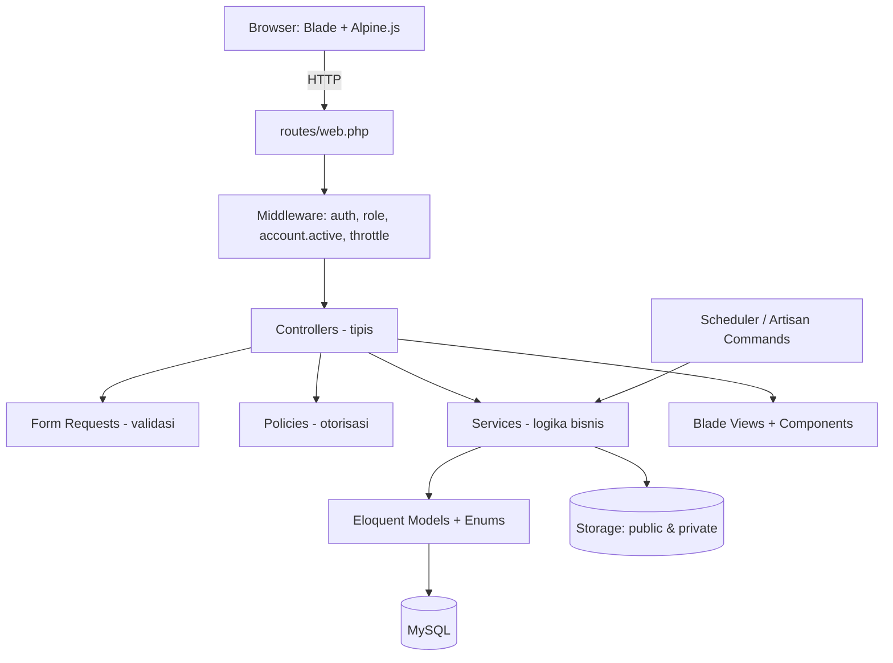
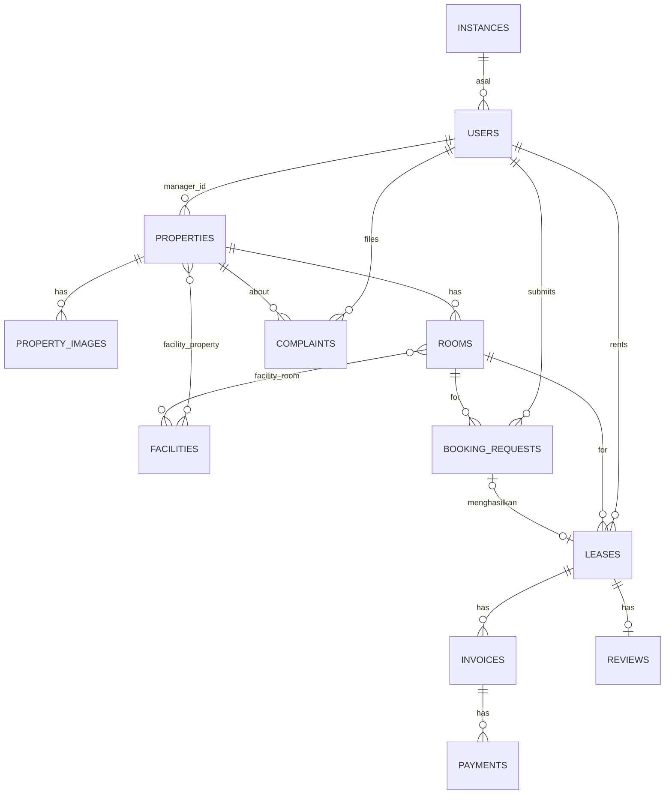
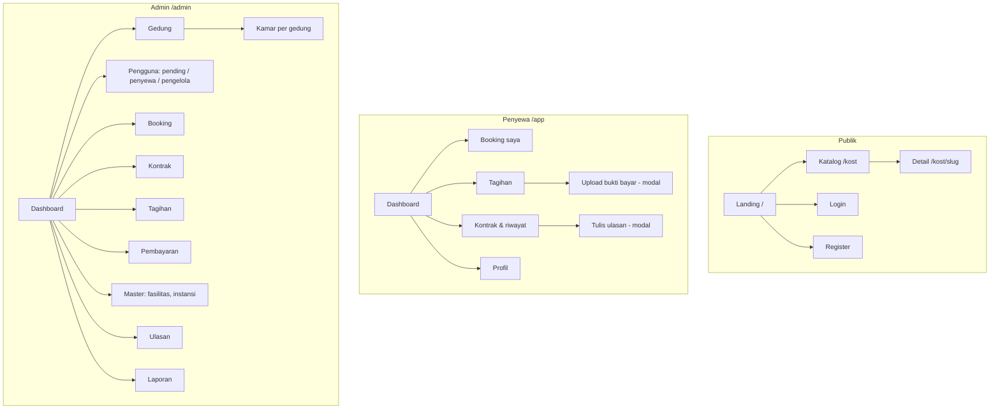
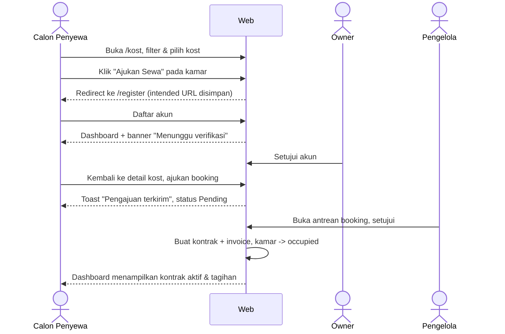
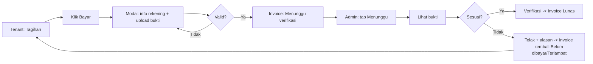

# Kost Antik — Project Blueprint

> Dokumen pra-coding: **PRD → SRS → SDD → UI/UX Flow → Task Breakdown**
> Referensi: [juhan26/HummaKost](https://github.com/juhan26/HummaKost) (Laravel 11, manajemen kontrakan)
> Repo target: [Fadhh12/Kost-Antik](https://github.com/Fadhh12/Kost-Antik)
> Versi: 1.0 · Status: Draft siap-coding · Pemilik: Nabil Fadhlur Rahman

---

## 0. Ringkasan Analisis Referensi (HummaKost)

HummaKost adalah aplikasi manajemen kontrakan untuk peserta magang, dibangun dengan Laravel 11 + Blade + Tailwind/Bootstrap + Spatie Permission. Modul yang ada: landing & katalog kontrakan (filter gender, ketersediaan, harga, urutan), pendaftaran penyewa dengan status `pending/accepted/rejected`, CRUD properti + galeri + fasilitas, kontrak sewa (validasi gender & kapasitas), pembayaran per bulan, ketua kontrakan (role `admin`), instansi asal, feedback/rating, dan dashboard statistik.

**Yang dipertahankan di Kost Antik:** konsep 3 role, approval penyewa, validasi gender, kapasitas otomatis (available/full), katalog publik dengan filter, feedback setelah kontrak, dashboard statistik.

**Yang diperbaiki di Kost Antik:**

| Masalah di referensi | Solusi di Kost Antik |
|---|---|
| Tidak ada konsep kamar; kapasitas dihitung per properti | Tambah entitas **Room** (kamar) dengan harga & status sendiri |
| Periode bayar disimpan sebagai string (`"01 August 2024"`) | **Invoice** per bulan dengan kolom `date` yang benar |
| Pembayaran hanya dicatat admin, tanpa bukti | Penyewa **upload bukti transfer**, admin **verifikasi** |
| Penyewa tidak bisa mengajukan sewa sendiri | Alur **Booking Request** dari halaman detail kost |
| Status kontrak tidak berubah otomatis | **Scheduler** harian: tandai invoice overdue & kontrak selesai |
| Typo kolom (`langtitude`, `longtitude`), logika bisnis di controller | Penamaan konsisten + **Service layer** + Enum |
| Campuran Bootstrap + DaisyUI + Flowbite | Satu sistem: **Tailwind + Alpine.js** dengan design token sendiri |

---

# 1. PRD — Product Requirements Document

## 1.1 Latar Belakang
Pengelolaan kost skala kecil–menengah masih banyak memakai WhatsApp dan buku catatan: ketersediaan kamar tidak jelas bagi calon penyewa, tagihan sering terlewat, dan pemilik sulit memantau pemasukan lintas gedung. Kost Antik adalah platform web untuk memasarkan kamar sekaligus mengelola penyewa, kontrak, dan pembayaran dalam satu tempat.

## 1.2 Tujuan Produk
1. Calon penyewa dapat menemukan kamar yang tersedia, melihat detail, dan mengajukan sewa secara online.
2. Pemilik dan pengelola dapat mengelola gedung, kamar, penyewa, kontrak, dan tagihan tanpa pencatatan manual.
3. Pembayaran tercatat transparan: tagihan otomatis, bukti bayar, verifikasi, dan riwayat.
4. Pemilik memiliki dashboard okupansi dan pendapatan secara real-time.

## 1.3 Sasaran & Metrik Keberhasilan (untuk demo/portofolio)
| Metrik | Target |
|---|---|
| Alur booking → kontrak aktif | ≤ 5 langkah bagi penyewa |
| Tagihan bulanan dibuat otomatis | 100% saat kontrak dibuat |
| Status overdue & kontrak selesai | Diperbarui otomatis tiap hari |
| Halaman publik (Lighthouse mobile) | Performance ≥ 85, Accessibility ≥ 90 |
| Test otomatis alur inti | Lulus (auth, booking, lease, invoice, payment) |

## 1.4 Persona & Role

| Role (Spatie) | Label di UI | Deskripsi | Kebutuhan utama |
|---|---|---|---|
| `guest` | Pengunjung | Belum login | Melihat katalog kost, detail, harga, fasilitas, ulasan |
| `tenant` | Penyewa | Mahasiswa/pekerja yang menyewa | Daftar, ajukan sewa, lihat tagihan, upload bukti bayar, beri ulasan |
| `manager` | Pengelola | Penjaga/pengelola satu atau beberapa gedung | Kelola kamar & penyewa di gedungnya, verifikasi pembayaran, proses booking |
| `owner` | Pemilik | Super admin | Semua akses: gedung, pengelola, laporan, master data |

> Catatan: role `admin` di referensi (ketua kontrakan) digantikan `manager` yang ditugaskan per gedung.

## 1.5 Ruang Lingkup Fitur

Prioritas: **P0** = wajib MVP, **P1** = penting, **P2** = nice-to-have.

### A. Publik
| ID | Fitur | Prioritas |
|---|---|---|
| F-01 | Landing page (hero, keunggulan, kost unggulan, ulasan, CTA) | P0 |
| F-02 | Katalog kost: cari nama/kota, filter gender (putra/putri/campur), rentang harga, ketersediaan, urutkan (terbaru, termurah, rating) | P0 |
| F-03 | Detail kost: galeri, deskripsi, aturan kost, fasilitas bersama, daftar kamar + status, peta lokasi (embed), ulasan & rating rata-rata | P0 |
| F-04 | Tombol "Ajukan Sewa" (arahkan login/daftar bila belum masuk) | P0 |

### B. Autentikasi & Akun
| ID | Fitur | Prioritas |
|---|---|---|
| F-05 | Registrasi penyewa (status awal `pending`) | P0 |
| F-06 | Login, logout, lupa & reset password | P0 |
| F-07 | Profil: ubah data, foto, ganti password | P0 |
| F-08 | reCAPTCHA pada registrasi | P2 |

### C. Penyewa
| ID | Fitur | Prioritas |
|---|---|---|
| F-09 | Dashboard penyewa: kontrak aktif, tagihan berikutnya, status verifikasi akun | P0 |
| F-10 | Ajukan booking kamar (tanggal mulai, durasi, catatan) & batalkan selama `pending` | P0 |
| F-11 | Daftar tagihan (invoice) + upload bukti bayar | P0 |
| F-12 | Riwayat kontrak & pembayaran | P1 |
| F-13 | Ulasan & rating setelah/selama kontrak (1 ulasan per kontrak) | P1 |
| F-14 | Laporan keluhan (kerusakan/fasilitas) + status | P2 |

### D. Pengelola
| ID | Fitur | Prioritas |
|---|---|---|
| F-15 | Dashboard gedung: okupansi, tagihan jatuh tempo, pembayaran menunggu verifikasi | P0 |
| F-16 | Kelola kamar (CRUD, status maintenance) pada gedung yang dikelola | P0 |
| F-17 | Proses booking (setujui → buat kontrak, tolak dengan alasan) | P0 |
| F-18 | Verifikasi / tolak pembayaran; catat pembayaran tunai manual | P0 |
| F-19 | Akhiri kontrak lebih awal (terminate) dengan alasan | P1 |
| F-20 | Tangani keluhan | P2 |

### E. Pemilik
| ID | Fitur | Prioritas |
|---|---|---|
| F-21 | Dashboard global: total gedung, kamar, okupansi %, pendapatan bulan ini, grafik pendapatan 6 bulan, tunggakan | P0 |
| F-22 | CRUD gedung + galeri foto + fasilitas + tugaskan pengelola | P0 |
| F-23 | Master fasilitas & instansi | P0 |
| F-24 | Kelola pengguna: setujui/tolak penyewa, tambah pengelola, nonaktifkan akun | P0 |
| F-25 | Semua fitur pengelola untuk seluruh gedung | P0 |
| F-26 | Moderasi ulasan (sembunyikan) | P1 |
| F-27 | Ekspor laporan pembayaran (CSV/PDF) per periode | P2 |

### Di luar cakupan (Out of Scope)
Payment gateway online, aplikasi mobile native, notifikasi WhatsApp/SMS, multi-bahasa, multi-tenant SaaS. (Notifikasi email dapat ditambahkan di P2.)

## 1.6 Alur Utama (User Flow Tingkat Tinggi)

```mermaid
flowchart LR
    A[Pengunjung buka katalog] --> B[Lihat detail kost]
    B --> C{Sudah login?}
    C -- Belum --> D[Daftar akun] --> E[Akun pending] --> F[Owner setujui akun]
    C -- Sudah --> G[Ajukan booking kamar]
    F --> G
    G --> H[Pengelola review]
    H -- Tolak --> I[Penyewa lihat alasan]
    H -- Setujui --> J[Kontrak aktif + invoice bulanan dibuat]
    J --> K[Penyewa upload bukti bayar]
    K --> L[Pengelola verifikasi]
    L -- Valid --> M[Invoice lunas]
    L -- Tidak valid --> K
    M --> N[Kontrak selesai otomatis di end_date]
    N --> O[Penyewa beri ulasan]
```



## 1.7 Asumsi & Batasan
- Satu penyewa hanya boleh memiliki **satu kontrak aktif** pada satu waktu.
- Satu kamar default kapasitas 1 orang (kolom `capacity` disiapkan untuk kamar berbagi).
- Pembayaran di luar sistem (transfer bank/tunai); sistem hanya mencatat & memverifikasi.
- Mata uang Rupiah, zona waktu `Asia/Jakarta`, bahasa UI Indonesia.
- Data dummy memadai untuk demo (≥ 3 gedung, ≥ 20 kamar, ≥ 15 penyewa, riwayat pembayaran 6 bulan).

---

# 2. SRS — Software Requirements Specification

## 2.1 Kebutuhan Fungsional per Modul

### FR-AUTH — Autentikasi
- FR-AUTH-01: Registrasi hanya membuat akun ber-role `tenant` dengan `status = pending`.
- FR-AUTH-02: Akun `pending` boleh login dan menjelajah, tetapi **tidak dapat** mengajukan booking; tampilkan banner "Akun menunggu verifikasi".
- FR-AUTH-03: Akun `rejected` atau `inactive` tidak dapat login; tampilkan pesan dengan alasan bila ada.
- FR-AUTH-04: Setelah login, arahkan sesuai role: owner/manager → `/admin/dashboard`, tenant → `/app/dashboard`.
- FR-AUTH-05: Throttle login 5 percobaan/menit per email+IP.

### FR-PROP — Gedung & Kamar
- FR-PROP-01: Owner dapat membuat, mengubah, menonaktifkan gedung. Gedung **tidak bisa dihapus** jika memiliki kontrak (aktif maupun historis); gunakan status `inactive`.
- FR-PROP-02: Gedung `inactive` tidak tampil di katalog publik.
- FR-PROP-03: Kamar punya status `available`, `occupied`, `maintenance`. Status `occupied` dikelola sistem (bukan input manual).
- FR-PROP-04: Kamar `maintenance` tidak dapat dibooking.
- FR-PROP-05: Ketersediaan gedung di katalog = jumlah kamar `available` > 0 → badge "Tersedia N kamar", selain itu "Penuh".
- FR-PROP-06: Harga "mulai dari" di katalog = harga kamar `available` termurah (atau termurah keseluruhan jika penuh).
- FR-PROP-07: Satu gedung dapat memiliki 1 pengelola; satu pengelola dapat mengelola beberapa gedung.

### FR-BOOK — Booking Request
- FR-BOOK-01: Hanya tenant `accepted` tanpa kontrak aktif dan tanpa booking `pending` lain yang dapat membuat booking.
- FR-BOOK-02: Gender tenant harus cocok dengan `gender_target` gedung (kecuali gedung `mixed`).
- FR-BOOK-03: Kamar harus `available` saat diajukan **dan** saat disetujui (cek ulang di dalam transaksi DB dengan row lock).
- FR-BOOK-04: Tenant dapat membatalkan booking selama `pending`.
- FR-BOOK-05: Penolakan wajib menyertakan alasan (min. 10 karakter).
- FR-BOOK-06: Persetujuan otomatis membuat Lease + seluruh Invoice, lalu mengubah kamar menjadi `occupied`. Booking lain yang `pending` untuk kamar yang sama otomatis ditolak dengan alasan "Kamar sudah disewa penyewa lain".
- FR-BOOK-07: Booking `pending` lebih dari 7 hari otomatis `expired` (scheduler).

### FR-LEASE — Kontrak Sewa
- FR-LEASE-01: Kontrak dapat dibuat dari booking yang disetujui **atau** langsung oleh pengelola/owner (penyewa walk-in) dengan validasi yang sama seperti FR-BOOK-01..03.
- FR-LEASE-02: `end_date = start_date + duration_months` (dikurangi 1 hari). Contoh: mulai 10 Jan, 3 bulan → selesai 9 Apr.
- FR-LEASE-03: `monthly_price` disalin (snapshot) dari harga kamar saat kontrak dibuat; perubahan harga kamar setelahnya tidak memengaruhi kontrak berjalan.
- FR-LEASE-04: `total_amount = monthly_price × duration_months`.
- FR-LEASE-05: Kode kontrak unik format `KA-LS-YYYYMM-XXXX`.
- FR-LEASE-06: Status: `active` → `completed` (otomatis setelah `end_date`) atau `terminated` (manual, wajib alasan).
- FR-LEASE-07: Saat `completed`/`terminated`, kamar kembali `available` (kecuali sedang `maintenance`); invoice `unpaid` dengan periode setelah tanggal terminasi dibatalkan (`void`).
- FR-LEASE-08: Kontrak `completed` dengan invoice belum lunas tetap bisa diselesaikan, namun tandai "Ada tunggakan" dan tampilkan di laporan tunggakan.
- FR-LEASE-09: Perpanjangan kontrak (P1): membuat kontrak baru berurutan dari `end_date + 1`, tidak mengubah kontrak lama.

### FR-INV — Tagihan (Invoice)
- FR-INV-01: Saat kontrak dibuat, sistem membuat **satu invoice per bulan** sebanyak `duration_months`.
- FR-INV-02: Invoice ke-n: `period_start = start_date + (n-1) bulan`, `period_end = period_start + 1 bulan - 1 hari`, `due_date = period_start + 3 hari` (masa tenggang, konfigurasi `KOST_GRACE_DAYS`).
- FR-INV-03: Nomor invoice unik `KA-INV-YYYYMM-XXXX`.
- FR-INV-04: Status: `unpaid` → `pending_verification` (ada pembayaran menunggu) → `paid`; `overdue` jika melewati `due_date` dan belum `paid`; `void` jika dibatalkan.
- FR-INV-05: Scheduler harian 00:05 WIB mengubah `unpaid` yang lewat `due_date` menjadi `overdue`.
- FR-INV-06: Nilai invoice = `monthly_price` (denda keterlambatan = P2, dinonaktifkan default).

### FR-PAY — Pembayaran
- FR-PAY-01: Tenant mengunggah bukti bayar untuk invoice miliknya yang berstatus `unpaid`/`overdue`. Satu invoice hanya boleh punya **satu** pembayaran `pending` pada satu waktu.
- FR-PAY-02: Nominal pembayaran harus **sama dengan** sisa tagihan invoice (tidak ada cicilan parsial di MVP).
- FR-PAY-03: Pengelola/owner memverifikasi: `verified` → invoice `paid`, `paid_at` diisi, `leases.paid_amount` bertambah. `rejected` → wajib alasan, invoice kembali ke status sebelumnya (`unpaid`/`overdue` tergantung tanggal).
- FR-PAY-04: Pengelola/owner dapat mencatat pembayaran **tunai**: langsung `verified`, bukti opsional.
- FR-PAY-05: Pembayaran `verified` tidak bisa dihapus; koreksi dilakukan owner dengan fitur "Batalkan verifikasi" (P1) yang tercatat di activity log.
- FR-PAY-06: Bukti bayar disimpan di storage privat; diakses melalui route yang dicek otorisasinya.

### FR-REV — Ulasan
- FR-REV-01: Tenant dapat memberi 1 ulasan per kontrak, jika kontrak `active` minimal 30 hari atau sudah `completed`.
- FR-REV-02: Rating bilangan bulat 1–5, komentar 10–500 karakter.
- FR-REV-03: Ulasan dapat diedit oleh penulis dalam 7 hari setelah dibuat.
- FR-REV-04: Owner dapat menyembunyikan ulasan (`is_published = false`). Rating rata-rata gedung hanya dari ulasan yang tampil.

### FR-USER — Manajemen Pengguna
- FR-USER-01: Owner menyetujui/menolak tenant `pending` (penolakan wajib alasan).
- FR-USER-02: Owner membuat akun pengelola (role `manager`, langsung `accepted`) dan menugaskannya ke gedung.
- FR-USER-03: Pengguna dengan kontrak/pembayaran tidak dapat dihapus; gunakan status `inactive` (soft-disable) dan soft delete.
- FR-USER-04: Pengelola hanya melihat tenant yang memiliki booking/kontrak di gedung yang ia kelola.

### FR-DASH — Dashboard & Laporan
- FR-DASH-01: Owner: total gedung, total kamar, okupansi % (`occupied / (total - maintenance)`), pendapatan bulan berjalan (sum pembayaran `verified` berdasar `verified_at`), jumlah invoice overdue, grafik pendapatan 6 bulan, booking & pembayaran yang menunggu tindakan.
- FR-DASH-02: Pengelola: metrik yang sama, dibatasi gedung yang ia kelola.
- FR-DASH-03: Tenant: kartu kontrak aktif (kamar, periode, sisa hari), invoice berikutnya + tombol bayar, progres pembayaran (`paid_amount / total_amount`).

## 2.2 Aturan Validasi Form

| Form | Field | Aturan |
|---|---|---|
| Registrasi | name | required, string, 3–100 |
| | email | required, email:rfc,dns, unique:users |
| | phone | required, regex `^(\+62\|62\|0)8[0-9]{8,12}$`, unique:users |
| | gender | required, in:male,female |
| | instance_id | nullable, exists:instances,id |
| | password | required, min:8, confirmed, harus mengandung huruf & angka |
| Login | email, password | required; throttle 5/menit |
| Profil | photo | nullable, image, mimes:jpg,jpeg,png,webp, max:2048 KB |
| Gedung | name | required, 3–100, unique:properties,name (ignore saat update) |
| | slug | otomatis dari name, unique |
| | address, city | required, max 255 / 100 |
| | gender_target | required, in:male,female,mixed |
| | latitude | nullable, numeric, between:-90,90 |
| | longitude | nullable, numeric, between:-180,180 |
| | description | nullable, max:2000 |
| | rules | nullable, max:2000 |
| | manager_id | nullable, exists:users,id dan user ber-role manager |
| | images[] | nullable, array max 10, tiap file image max 3 MB |
| Kamar | code | required, max 20, unique per property_id |
| | floor | nullable, integer 0–50 |
| | size_m2 | nullable, numeric 2–100 |
| | monthly_price | required, integer, min 100000, max 50000000 |
| | capacity | required, integer 1–4 |
| | status (input) | in:available,maintenance (occupied hanya oleh sistem) |
| | facilities[] | nullable, array, exists:facilities,id |
| Booking | room_id | required, exists, kamar available, gedung active |
| | start_date | required, date, after_or_equal:today, before_or_equal:today+60 hari |
| | duration_months | required, integer, in:1,3,6,12 |
| | note | nullable, max:500 |
| Tolak (booking/akun/pembayaran) | reason | required, 10–500 |
| Kontrak manual | user_id, room_id, start_date, duration_months | sama seperti booking; start_date boleh s/d 30 hari ke belakang untuk input data lama |
| Terminasi | terminated_at | required, date, between start_date dan end_date |
| | reason | required, 10–500 |
| Pembayaran (tenant) | invoice_id | required, milik user, status unpaid/overdue, tidak ada payment pending |
| | amount | required, integer, sama dengan invoice.amount |
| | method | required, in:transfer |
| | paid_at | required, date, before_or_equal:today |
| | proof | required, image/pdf, max 3 MB |
| Pembayaran tunai (admin) | method | in:cash; proof nullable |
| Ulasan | rating | required, integer 1–5 |
| | comment | required, 10–500 |
| Fasilitas | name | required, unique, max 50; icon nullable (nama ikon Lucide) |
| | type | required, in:room,shared |
| Instansi | name | required, unique, max 150; type in:campus,office,other |

Semua pesan error dalam Bahasa Indonesia (`lang/id/validation.php`).

## 2.3 Aturan Bisnis (Business Rules)

| ID | Aturan |
|---|---|
| BR-01 | Satu tenant maksimal 1 kontrak `active` dan 1 booking `pending`. |
| BR-02 | Gender tenant wajib sesuai `gender_target` gedung, kecuali `mixed`. |
| BR-03 | Kamar `occupied` hanya karena ada kontrak `active`; sistem menjaga konsistensi ini. |
| BR-04 | Harga kontrak adalah snapshot saat kontrak dibuat. |
| BR-05 | Invoice dibuat penuh di awal kontrak; tidak ada invoice di luar periode kontrak. |
| BR-06 | Tidak ada pembayaran parsial di MVP; satu pembayaran melunasi satu invoice. |
| BR-07 | Data finansial (lease, invoice, payment verified) tidak pernah di-hard-delete. |
| BR-08 | Pengelola hanya bisa melihat & mengubah data di gedung yang ditugaskan (Policy + query scope). |
| BR-09 | Setiap aksi penting (approve/reject/verify/terminate/ubah harga) dicatat di `activity_logs`. |
| BR-10 | Semua operasi yang mengubah lebih dari satu tabel dibungkus `DB::transaction`. |
| BR-11 | Tanggal disimpan tipe `date`/`timestamp`; format tampilan `d M Y` (locale id). |
| BR-12 | Uang disimpan sebagai `unsignedBigInteger` (Rupiah, tanpa desimal); tampilan `Rp1.250.000`. |

## 2.4 Perilaku Sistem (Behavior)

- **Feedback aksi:** setiap aksi menampilkan toast (sukses/gagal) dan redirect ke halaman asal; aksi destruktif memakai modal konfirmasi.
- **Empty state:** setiap tabel/list memiliki empty state dengan ilustrasi sederhana dan CTA relevan.
- **Loading:** tombol submit menjadi disabled + spinner saat proses untuk mencegah double submit.
- **Pagination:** 10 baris untuk tabel admin, 9 kartu untuk katalog; query string filter dipertahankan.
- **Pencarian:** debounce 400 ms di katalog; filter disimpan di URL agar bisa dibagikan.
- **Error page:** 403, 404, 419, 500 dengan desain konsisten dan tombol kembali.
- **Scheduler (`routes/console.php`):**
  - `invoices:mark-overdue` — harian 00:05
  - `leases:complete-expired` — harian 00:10
  - `bookings:expire-stale` — harian 00:15
- **Notifikasi in-app (P1):** badge di navbar admin untuk jumlah booking & pembayaran menunggu.

## 2.5 Kebutuhan Non-Fungsional

| Kategori | Kebutuhan |
|---|---|
| Keamanan | CSRF, hashing bcrypt, otorisasi via Policy/Gate di setiap aksi, rate limit login, file upload divalidasi MIME, bukti bayar di disk privat, mass-assignment guarded |
| Performa | Eager loading (hindari N+1), index pada FK & kolom filter, gambar dikompresi ≤ 1600px (Intervention Image, P1) |
| Aksesibilitas | Kontras WCAG AA, label pada semua input, fokus terlihat, navigasi keyboard untuk modal & dropdown |
| Responsif | Mobile-first; breakpoint 375 / 768 / 1280 px; tabel admin berubah menjadi kartu di mobile |
| Kualitas kode | Laravel Pint (PSR-12), Feature test untuk alur inti, tanpa logika bisnis di Blade/controller |
| Kompatibilitas | Chrome, Firefox, Safari, Edge versi terbaru |

---

# 3. SDD — System Design Document

## 3.1 Tech Stack

| Lapisan | Pilihan |
|---|---|
| Backend | PHP 8.2+, **Laravel 11** |
| Frontend | **Blade + Tailwind CSS 3 + Alpine.js**, Vite, ikon **Lucide** |
| Grafik | Chart.js (dashboard) |
| Peta | Leaflet + OpenStreetMap (tanpa API key) |
| Database | MySQL 8 (dev boleh SQLite) |
| Auth | Laravel Breeze (Blade) — dikustomisasi |
| Role & permission | spatie/laravel-permission |
| Activity log | spatie/laravel-activitylog (P1) |
| PDF (P2) | barryvdh/laravel-dompdf |
| Testing | PHPUnit / Pest, Laravel factories & seeders |

## 3.2 Arsitektur

Monolit MVC berlapis (server-rendered), tanpa SPA.



**Prinsip:** Controller hanya menerima request → panggil Service → return view/redirect. Semua aturan bisnis (BR-xx) berada di Service dan diuji dengan test.

## 3.3 Struktur Folder Backend

```
app/
├── Console/Commands/
│   ├── MarkOverdueInvoices.php
│   ├── CompleteExpiredLeases.php
│   └── ExpireStaleBookings.php
├── Enums/
│   ├── Gender.php               (male, female)
│   ├── GenderTarget.php         (male, female, mixed)
│   ├── UserStatus.php           (pending, accepted, rejected, inactive)
│   ├── RoomStatus.php           (available, occupied, maintenance)
│   ├── BookingStatus.php        (pending, approved, rejected, cancelled, expired)
│   ├── LeaseStatus.php          (active, completed, terminated)
│   ├── InvoiceStatus.php        (unpaid, pending_verification, paid, overdue, void)
│   ├── PaymentStatus.php        (pending, verified, rejected)
│   └── PaymentMethod.php        (transfer, cash)
├── Http/
│   ├── Controllers/
│   │   ├── Public/   (HomeController, PropertyCatalogController)
│   │   ├── Tenant/   (DashboardController, BookingController, InvoiceController,
│   │   │              PaymentController, ReviewController, LeaseHistoryController)
│   │   ├── Admin/    (DashboardController, PropertyController, PropertyImageController,
│   │   │              RoomController, FacilityController, InstanceController,
│   │   │              UserController, BookingController, LeaseController,
│   │   │              InvoiceController, PaymentController, ReviewController, ReportController)
│   │   ├── ProfileController.php
│   │   └── PaymentProofController.php   (stream file privat + otorisasi)
│   ├── Middleware/EnsureAccountIsActive.php
│   └── Requests/ (Store/Update per entitas)
├── Models/ (User, Instance, Property, PropertyImage, Room, Facility, BookingRequest,
│            Lease, Invoice, Payment, Review, Complaint)
├── Policies/ (PropertyPolicy, RoomPolicy, BookingPolicy, LeasePolicy,
│              InvoicePolicy, PaymentPolicy, ReviewPolicy, UserPolicy)
├── Services/
│   ├── BookingService.php     (create, cancel, approve, reject)
│   ├── LeaseService.php       (createFromBooking, createManual, terminate, complete)
│   ├── InvoiceService.php     (generateForLease, markOverdue, voidAfter)
│   ├── PaymentService.php     (submit, recordCash, verify, reject)
│   ├── DashboardService.php   (metrik owner/manager/tenant)
│   └── CodeGenerator.php      (KA-LS-..., KA-INV-...)
└── View/Components/ (AppLayout, AdminLayout, StatCard, StatusBadge, Money, EmptyState, Modal)
```

## 3.4 Desain Database

### ERD



### Skema Tabel

**users**
| Kolom | Tipe | Keterangan |
|---|---|---|
| id | bigint PK | |
| name | varchar(100) | |
| email | varchar(255) unique | |
| phone | varchar(20) unique | |
| gender | enum(male,female) | |
| photo_path | varchar nullable | |
| instance_id | FK instances nullable, nullOnDelete | |
| status | enum(pending,accepted,rejected,inactive) default pending | index |
| status_reason | varchar(500) nullable | alasan tolak/nonaktif |
| email_verified_at, password, remember_token, timestamps, deleted_at | | soft delete |

**instances** — id, name (unique), type enum(campus,office,other), address nullable, timestamps

**properties**
| Kolom | Tipe | Keterangan |
|---|---|---|
| id | bigint PK | |
| manager_id | FK users nullable, nullOnDelete | |
| name | varchar(100) unique | |
| slug | varchar unique | URL publik |
| address | varchar(255) | |
| city | varchar(100) | index |
| latitude | decimal(10,7) nullable | |
| longitude | decimal(10,7) nullable | |
| gender_target | enum(male,female,mixed) | index |
| description | text nullable | |
| rules | text nullable | aturan kost |
| status | enum(active,inactive) default active | |
| timestamps, deleted_at | | |

**property_images** — id, property_id FK cascade, path, is_cover bool default false, sort_order smallint, timestamps

**rooms**
| Kolom | Tipe | Keterangan |
|---|---|---|
| id | bigint PK | |
| property_id | FK restrictOnDelete | |
| code | varchar(20) | unique(property_id, code) |
| floor | tinyint nullable | |
| size_m2 | decimal(5,2) nullable | |
| monthly_price | unsignedBigInteger | Rupiah |
| capacity | tinyint default 1 | |
| status | enum(available,occupied,maintenance) default available | index |
| timestamps | | |

**facilities** — id, name unique, icon nullable, type enum(room,shared), timestamps
**facility_property** — property_id, facility_id (PK gabungan, cascade)
**facility_room** — room_id, facility_id (PK gabungan, cascade)

**booking_requests**
| Kolom | Tipe | Keterangan |
|---|---|---|
| id | bigint PK | |
| user_id | FK users restrict | |
| room_id | FK rooms restrict | |
| start_date | date | |
| duration_months | tinyint | |
| note | varchar(500) nullable | |
| status | enum(pending,approved,rejected,cancelled,expired) | index |
| reviewed_by | FK users nullable | |
| reviewed_at | timestamp nullable | |
| reject_reason | varchar(500) nullable | |
| timestamps | | |

**leases**
| Kolom | Tipe | Keterangan |
|---|---|---|
| id | bigint PK | |
| code | varchar(30) unique | KA-LS-YYYYMM-XXXX |
| user_id | FK users restrict | |
| room_id | FK rooms restrict | |
| booking_request_id | FK nullable | |
| start_date, end_date | date | |
| duration_months | tinyint | |
| monthly_price | unsignedBigInteger | snapshot |
| total_amount | unsignedBigInteger | |
| paid_amount | unsignedBigInteger default 0 | |
| status | enum(active,completed,terminated) | index |
| terminated_at | date nullable | |
| termination_reason | varchar(500) nullable | |
| created_by | FK users | |
| timestamps | | |

**invoices**
| Kolom | Tipe | Keterangan |
|---|---|---|
| id | bigint PK | |
| lease_id | FK leases restrict | |
| number | varchar(30) unique | KA-INV-YYYYMM-XXXX |
| sequence | tinyint | bulan ke-n |
| period_start, period_end | date | |
| due_date | date | index |
| amount | unsignedBigInteger | |
| status | enum(unpaid,pending_verification,paid,overdue,void) | index |
| paid_at | timestamp nullable | |
| timestamps | | |

**payments**
| Kolom | Tipe | Keterangan |
|---|---|---|
| id | bigint PK | |
| invoice_id | FK invoices restrict | |
| amount | unsignedBigInteger | |
| method | enum(transfer,cash) | |
| paid_at | date | tanggal bayar menurut penyewa |
| proof_path | varchar nullable | disk `local` (privat) |
| status | enum(pending,verified,rejected) | index |
| submitted_by | FK users | |
| verified_by | FK users nullable | |
| verified_at | timestamp nullable | index (laporan pendapatan) |
| reject_reason | varchar(500) nullable | |
| timestamps | | |

**reviews** — id, lease_id FK unique, user_id FK, property_id FK, rating tinyint, comment varchar(500), is_published bool default true, timestamps

**complaints (P2)** — id, user_id, property_id, room_id nullable, title, description, photo_path nullable, status enum(open,in_progress,resolved), resolved_at nullable, timestamps

**activity_log** — dari spatie/laravel-activitylog

## 3.5 Rute (Web "API") — Kontrak Endpoint

Aplikasi server-rendered; endpoint di bawah adalah route web (form POST + redirect). Endpoint JSON hanya untuk grafik dashboard.

### Publik
| Method | URI | Nama | Keterangan |
|---|---|---|---|
| GET | `/` | home | Landing |
| GET | `/kost` | kost.index | Katalog + filter (`q, city, gender, min_price, max_price, available, sort`) |
| GET | `/kost/{property:slug}` | kost.show | Detail kost |

### Auth (Breeze)
`GET/POST /login`, `GET/POST /register`, `POST /logout`, `GET/POST /forgot-password`, `GET/POST /reset-password/{token}`

### Penyewa — prefix `/app`, middleware `auth, account.active, role:tenant`
| Method | URI | Keterangan |
|---|---|---|
| GET | `/app/dashboard` | Dashboard penyewa |
| GET | `/app/bookings` | Daftar booking saya |
| POST | `/app/bookings` | Buat booking (FR-BOOK) |
| PATCH | `/app/bookings/{booking}/cancel` | Batalkan booking |
| GET | `/app/leases` | Riwayat kontrak |
| GET | `/app/leases/{lease}` | Detail kontrak + invoice |
| GET | `/app/invoices` | Daftar tagihan |
| POST | `/app/invoices/{invoice}/payments` | Upload bukti bayar |
| POST | `/app/leases/{lease}/review` | Buat ulasan |
| PUT | `/app/reviews/{review}` | Edit ulasan (≤ 7 hari) |

### Admin — prefix `/admin`, middleware `auth, account.active, role:owner|manager`
| Method | URI | Role | Keterangan |
|---|---|---|---|
| GET | `/admin/dashboard` | owner, manager | Dashboard (discoped) |
| GET | `/admin/dashboard/revenue-chart` | owner, manager | JSON 6 bulan |
| RESOURCE | `/admin/properties` | owner (manager: index/show/edit terbatas) | CRUD gedung |
| POST | `/admin/properties/{property}/images` | owner | Upload foto |
| DELETE | `/admin/property-images/{image}` | owner | Hapus foto |
| PATCH | `/admin/property-images/{image}/cover` | owner | Jadikan cover |
| RESOURCE (nested) | `/admin/properties/{property}/rooms` | owner, manager | CRUD kamar |
| RESOURCE | `/admin/facilities` | owner | Master fasilitas |
| RESOURCE | `/admin/instances` | owner | Master instansi |
| GET | `/admin/users` | owner, manager | Daftar pengguna (tab: pending, penyewa, pengelola) |
| POST | `/admin/users/managers` | owner | Buat akun pengelola |
| PATCH | `/admin/users/{user}/approve` | owner | Setujui tenant |
| PATCH | `/admin/users/{user}/reject` | owner | Tolak tenant (reason) |
| PATCH | `/admin/users/{user}/deactivate` | owner | Nonaktifkan |
| GET | `/admin/bookings` | owner, manager | Antrean booking |
| PATCH | `/admin/bookings/{booking}/approve` | owner, manager | Setujui → buat kontrak |
| PATCH | `/admin/bookings/{booking}/reject` | owner, manager | Tolak (reason) |
| GET | `/admin/leases` | owner, manager | Daftar kontrak + filter |
| POST | `/admin/leases` | owner, manager | Kontrak manual (walk-in) |
| GET | `/admin/leases/{lease}` | owner, manager | Detail kontrak |
| PATCH | `/admin/leases/{lease}/terminate` | owner, manager | Akhiri kontrak |
| GET | `/admin/invoices` | owner, manager | Semua tagihan + filter status/periode |
| GET | `/admin/payments` | owner, manager | Pembayaran (tab: menunggu, terverifikasi, ditolak) |
| POST | `/admin/invoices/{invoice}/payments/cash` | owner, manager | Catat tunai |
| PATCH | `/admin/payments/{payment}/verify` | owner, manager | Verifikasi |
| PATCH | `/admin/payments/{payment}/reject` | owner, manager | Tolak (reason) |
| GET | `/admin/reviews` | owner | Moderasi ulasan |
| PATCH | `/admin/reviews/{review}/toggle` | owner | Tampilkan/sembunyikan |
| GET | `/admin/reports/payments` | owner | Laporan + export CSV (P2) |

### Bersama
| Method | URI | Keterangan |
|---|---|---|
| GET/PATCH | `/profile` | Profil |
| PUT | `/profile/password` | Ganti password |
| GET | `/payments/{payment}/proof` | Stream bukti bayar (PaymentPolicy@viewProof) |

### Matriks Otorisasi Ringkas
| Resource | Owner | Manager | Tenant |
|---|---|---|---|
| Gedung | CRUD semua | Lihat & ubah info dasar gedungnya | Lihat publik |
| Kamar | CRUD semua | CRUD di gedungnya | Lihat publik |
| Pengguna | Semua aksi | Lihat penyewa di gedungnya | Profil sendiri |
| Booking | Approve/reject semua | Approve/reject di gedungnya | Buat/batal milik sendiri |
| Kontrak | Semua | Di gedungnya | Lihat milik sendiri |
| Invoice/Payment | Semua | Di gedungnya | Milik sendiri, upload bukti |
| Ulasan | Moderasi | Lihat | Buat/edit milik sendiri |

## 3.6 Logika Service Kunci (pseudocode)

```php
// BookingService::approve(BookingRequest $booking, User $actor): Lease
DB::transaction(function () use ($booking, $actor) {
    $room = Room::lockForUpdate()->findOrFail($booking->room_id);
    abort_unless($booking->status === BookingStatus::Pending, 422);
    abort_unless($room->status === RoomStatus::Available, 422, 'Kamar tidak tersedia');
    $this->assertTenantEligible($booking->user, $room->property); // BR-01, BR-02

    $lease = $this->leaseService->create($booking->user, $room, $booking->start_date,
                                         $booking->duration_months, $actor, $booking);
    $booking->update(['status' => 'approved', 'reviewed_by' => $actor->id, 'reviewed_at' => now()]);
    BookingRequest::where('room_id', $room->id)->where('status', 'pending')
        ->whereKeyNot($booking->id)
        ->update(['status' => 'rejected', 'reject_reason' => 'Kamar sudah disewa penyewa lain']);
    return $lease;
});

// LeaseService::create(...)
// - hitung end_date, snapshot monthly_price, total_amount, code
// - InvoiceService::generateForLease($lease)
// - $room->update(['status' => 'occupied'])

// PaymentService::verify(Payment $p, User $actor)
// - lock invoice; p.status=verified; invoice.status=paid, paid_at=now()
// - lease.increment('paid_amount', p.amount); activity log
```

## 3.7 Seeder & Data Dummy
- `RoleSeeder`: owner, manager, tenant
- `UserSeeder`: 1 owner (`owner@kostantik.test` / `password`), 2 manager, 20 tenant (campuran status)
- `InstanceSeeder`: 6 kampus/kantor di Bekasi–Cikarang
- `FacilitySeeder`: 12 fasilitas (AC, kasur, lemari, meja belajar, KM dalam, Wi-Fi, dapur bersama, parkir motor, laundry, CCTV, dll.)
- `PropertySeeder`: 3–4 gedung (putra, putri, campur) dengan 6–8 kamar masing-masing, foto placeholder lokal
- `LeaseSeeder`: kontrak aktif & selesai dengan invoice & payment 6 bulan ke belakang (untuk grafik)
- `ReviewSeeder`: 10–15 ulasan

## 3.8 Konfigurasi `.env` tambahan
```
APP_TIMEZONE=Asia/Jakarta
APP_LOCALE=id
KOST_GRACE_DAYS=3
KOST_BOOKING_EXPIRE_DAYS=7
KOST_BANK_INFO="BCA 1234567890 a.n. Kost Antik"
```

---

# 4. UI/UX Flow

## 4.1 Arah Desain
- **Konsep:** "Kost Antik" — karakter rumah lama Indonesia: motif **tegel kunci** (ubin antik), kayu jati, kuningan. Hangat tetapi rapi dan modern; bukan tema vintage yang kusam.
- **Wajib:** desain final ditentukan menggunakan skill **frontend-design** (hindari tampilan template generik/admin template bawaan). Palet, tipografi, dan motif harus terasa khas untuk brand ini.
- **Dua wajah UI:**
  1. **Publik & penyewa** — ekspresif, foto besar, tipografi berkarakter.
  2. **Admin** — padat informasi, tenang, fokus pada tabel, status, dan aksi cepat; tetap memakai token warna & tipografi yang sama.
- **Design token** didefinisikan di `tailwind.config.js` (warna, font, radius, shadow) dan dipakai konsisten; tidak ada warna hardcode di Blade.
- **Komponen Blade wajib:** button (primary/secondary/ghost/danger), input, select, textarea, file-upload dengan preview, badge status, stat card, tabel responsif, modal konfirmasi, toast, empty state, pagination, breadcrumb, tabs, dropdown user.
- **Pemetaan warna status (konsisten di seluruh app):** available/paid/verified/active = sukses; pending/pending_verification = peringatan; overdue/rejected = bahaya; maintenance/void/cancelled/expired/completed = netral.

## 4.2 Sitemap



## 4.3 Daftar Layar & Isi

| # | Layar | Elemen utama |
|---|---|---|
| P1 | Landing | Navbar (logo, Cari Kost, Masuk/Daftar), hero dengan pencarian kota + gender, kost unggulan (3 kartu), alasan memilih (fasilitas, transparansi tagihan, lokasi), cara menyewa (3 langkah — memang berurutan), ulasan penghuni, CTA, footer (kontak, alamat, jam operasional) |
| P2 | Katalog | Sidebar/drawer filter (kota, gender, harga min–max, hanya tersedia), sort, grid kartu (foto cover, nama, kota, badge gender, harga mulai dari, sisa kamar, rating), pagination, empty state "Tidak ada kost yang cocok" + reset filter |
| P3 | Detail kost | Galeri (1 besar + 4 kecil, lightbox), nama + badge gender + rating, alamat, deskripsi, fasilitas bersama (ikon), tabel/daftar kamar (kode, lantai, luas, fasilitas, harga, status, tombol Ajukan), aturan kost, peta Leaflet, ulasan, sticky card harga di desktop / sticky bottom bar di mobile |
| P4 | Modal/halaman Ajukan Sewa | Ringkasan kamar, date picker mulai, pilihan durasi (1/3/6/12 bulan) dengan total otomatis, catatan, persetujuan aturan kost, submit |
| P5 | Login / Register / Lupa password | Layout split: ilustrasi/foto + form; register menampilkan informasi bahwa akun akan diverifikasi |
| T1 | Dashboard penyewa | Banner status akun (jika pending/rejected), kartu kontrak aktif (kamar, gedung, periode, sisa hari, progres bayar), tagihan berikutnya + tombol Bayar, booking terakhir + status, info rekening |
| T2 | Tagihan | Tab: Belum dibayar / Menunggu verifikasi / Lunas; baris invoice (periode, jatuh tempo, nominal, status, aksi) |
| T3 | Upload bukti (modal) | Info rekening, nominal (read-only), tanggal bayar, drag & drop bukti + preview, submit |
| T4 | Kontrak & riwayat | Timeline kontrak, detail invoice & pembayaran, tombol tulis ulasan bila memenuhi syarat |
| A1 | Dashboard admin | Stat cards (gedung, kamar, okupansi %, pendapatan bulan ini, overdue), grafik pendapatan 6 bulan, panel "Perlu tindakan" (booking pending, pembayaran menunggu, akun pending), okupansi per gedung (progress bar) |
| A2 | Gedung (list/detail/form) | Tabel gedung (nama, kota, gender, kamar terisi/total, pengelola, status); detail dengan tab Info / Kamar / Foto / Fasilitas / Ulasan; form dengan upload multi-foto & pilih lokasi di peta |
| A3 | Kamar | Grid "denah" kamar berwarna sesuai status + tabel; form kamar di slide-over |
| A4 | Pengguna | Tab Pending (aksi setujui/tolak), Penyewa, Pengelola; detail user (profil, kontrak, pembayaran) |
| A5 | Booking | Tabel antrean; slide-over detail (profil penyewa, kamar, tanggal, durasi, total) + Setujui/Tolak |
| A6 | Kontrak | Filter status/gedung, badge "Ada tunggakan"; detail kontrak dengan jadwal invoice; tombol Kontrak Baru (walk-in) & Akhiri Kontrak |
| A7 | Pembayaran | Tab Menunggu (preview bukti di modal besar, verifikasi/tolak), Terverifikasi, Ditolak; tombol Catat Tunai |
| A8 | Master data | Fasilitas & instansi — tabel + modal form |
| A9 | Ulasan | List dengan toggle tampil/sembunyi |
| E | Error 403/404/419/500 | Ilustrasi sederhana + tombol kembali |

## 4.4 Flow Detail

### Flow 1 — Calon penyewa sampai kontrak aktif


### Flow 2 — Pembayaran


### Flow 3 — Admin membuat kontrak walk-in
Admin → Kontrak → "Kontrak Baru" → pilih penyewa (hanya accepted & tanpa kontrak aktif) → pilih gedung (difilter gender) → pilih kamar tersedia → tanggal & durasi → pratinjau total & jadwal invoice → simpan (opsional langsung catat pembayaran bulan pertama tunai).

### Flow 4 — Akhir kontrak
Scheduler menandai `completed` → kamar `available` → dashboard penyewa menampilkan ajakan menulis ulasan dan tombol "Sewa lagi" (membuka booking kamar yang sama bila tersedia).

## 4.5 Prinsip Interaksi
- Maksimal 1 aksi primer per layar; aksi destruktif selalu dengan modal konfirmasi bertuliskan konsekuensinya.
- Status selalu tampil sebagai badge teks + warna (tidak hanya warna).
- Angka uang rata kanan di tabel, font tabular.
- Form panjang dibagi per bagian; error ditampilkan di bawah field dan diringkas di atas form.
- Mobile: navigasi admin memakai drawer; tabel berubah jadi kartu; aksi utama di bottom bar.

---

# 5. Task Breakdown

Estimasi untuk 1 developer (dibantu AI). Setiap fase diakhiri commit & push ke `main` repo `Fadhh12/Kost-Antik`.

### Fase 0 — Setup Proyek (±0,5 hari)
- [ ] `laravel new` (Laravel 11) di root repo, pertahankan README lama lalu tulis ulang
- [ ] Install Breeze (Blade), Tailwind, Alpine, Lucide, spatie/laravel-permission
- [ ] Set timezone, locale `id`, file terjemahan validasi Indonesia
- [ ] Salin blueprint ini ke `docs/BLUEPRINT.md`
- [ ] Laravel Pint, `.env.example` lengkap, `.gitignore` benar
- **Selesai jika:** `php artisan serve` + `npm run dev` jalan, halaman default tampil.
- **Commit:** `chore: bootstrap laravel 11 project with breeze, tailwind, alpine`

### Fase 1 — Design System & Layout (±1,5 hari)
- [ ] Jalankan skill **frontend-design**: tentukan palet, tipografi, motif tegel, token
- [ ] Token di `tailwind.config.js`; font di-load (Google Fonts atau self-host)
- [ ] Blade components (daftar di 4.1) + halaman `/_styleguide` (hanya env local)
- [ ] Layout: `layouts.public`, `layouts.tenant`, `layouts.admin` (sidebar + topbar + drawer mobile)
- [ ] Halaman error 403/404/419/500
- **Selesai jika:** styleguide menampilkan semua komponen di mobile & desktop.
- **Commit:** `feat(ui): design system, blade components, and layouts`

### Fase 2 — Database & Domain (±1 hari)
- [ ] Enums (3.3)
- [ ] Migration semua tabel (3.4) + index
- [ ] Model + relasi + casts enum + scope (`forManager`, `available`, `active`)
- [ ] Factory & seeder (3.7)
- **Selesai jika:** `php artisan migrate:fresh --seed` sukses dan data konsisten.
- **Commit:** `feat(db): schema, models, enums, factories, and seeders`

### Fase 3 — Auth, Role & Akun (±1 hari)
- [ ] Kustomisasi register (phone, gender, instansi) → status pending + role tenant
- [ ] Middleware `EnsureAccountIsActive`, redirect per role
- [ ] Throttle login, halaman profil & ganti password, upload foto
- [ ] Policies dasar + Gate `before` untuk owner
- **Commit:** `feat(auth): registration flow, roles, account status, profile`

### Fase 4 — Halaman Publik (±2 hari)
- [ ] Landing (P1)
- [ ] Katalog dengan filter, sort, pagination, query string (P2)
- [ ] Detail kost + galeri lightbox + Leaflet + daftar kamar + ulasan (P3)
- [ ] SEO dasar: title, meta description, Open Graph per kost
- **Commit:** `feat(public): landing, catalog with filters, property detail`

### Fase 5 — Admin: Master Data, Gedung & Kamar (±2 hari)
- [ ] CRUD fasilitas & instansi (modal)
- [ ] CRUD gedung + upload multi-foto + cover + pilih lokasi peta + tugaskan pengelola
- [ ] CRUD kamar (grid denah + tabel + slide-over form)
- [ ] Scoping manager
- **Commit:** `feat(admin): properties, rooms, facilities, instances`

### Fase 6 — Pengguna & Booking (±1,5 hari)
- [ ] Manajemen pengguna (approve/reject/deactivate, buat pengelola)
- [ ] BookingService + form ajukan sewa (P4) + booking saya (tenant)
- [ ] Antrean booking admin (approve/reject)
- **Commit:** `feat(booking): user approval and booking request flow`

### Fase 7 — Kontrak & Tagihan (±2 hari)
- [ ] LeaseService, InvoiceService, CodeGenerator
- [ ] Kontrak dari booking & walk-in, detail kontrak, terminate
- [ ] Daftar tagihan admin & tenant
- [ ] Artisan commands + jadwal scheduler
- **Commit:** `feat(lease): leases, invoice generation, scheduled status updates`

### Fase 8 — Pembayaran (±1,5 hari)
- [ ] Upload bukti (tenant) ke disk privat + route stream terproteksi
- [ ] Verifikasi/tolak & catat tunai (admin)
- [ ] Update `paid_amount`, status invoice, activity log
- **Commit:** `feat(payment): proof upload, verification, cash recording`

### Fase 9 — Dashboard, Ulasan & Laporan (±1,5 hari)
- [ ] DashboardService + dashboard owner/manager (Chart.js) + tenant
- [ ] Ulasan tenant + moderasi owner + rating rata-rata di katalog
- [ ] (P2) Export CSV laporan pembayaran
- **Commit:** `feat(dashboard): metrics, charts, reviews, reports`

### Fase 10 — Testing, Polish & Dokumentasi (±1,5 hari)
- [ ] Feature test: registrasi, booking eligible/tidak eligible (gender, kontrak aktif, kamar penuh), approve booking membuat N invoice, verifikasi pembayaran, scheduler overdue & complete, otorisasi manager lintas gedung (403)
- [ ] Audit responsif (375/768/1280), aksesibilitas (label, kontras, fokus), empty & loading state
- [ ] README: deskripsi, fitur, screenshot, stack, cara install, akun demo, struktur folder, ERD
- [ ] `CHANGELOG.md` / ringkasan pekerjaan
- **Commit:** `test: core flows` · `docs: readme and changelog`

**Total estimasi:** ±16 hari kerja.

### Definition of Done (per fitur)
1. Sesuai FR & BR terkait di dokumen ini.
2. Validasi server-side + pesan Bahasa Indonesia.
3. Otorisasi via Policy; diuji minimal 1 skenario ditolak.
4. Responsif & memiliki empty/error state.
5. Lulus `php artisan test` dan `./vendor/bin/pint --test`.
6. Di-commit dengan pesan Conventional Commits dan di-push.
